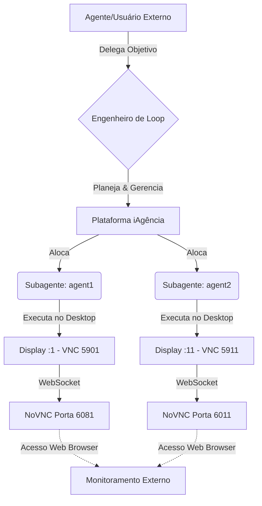

# 🚀 iAgência: O Sistema Operacional para Agentes de IA

> **A missão:** Evoluir continuamente a plataforma iAgência para se tornar a melhor e mais autônoma infraestrutura de execução para agentes de IA do mundo.

*(Diagrama representativo da arquitetura Open Infra)*

## 👁️ A Nova Visão: Inteligência na Plataforma

A iAgência não é apenas um ambiente de execução isolado. É um **Sistema Operacional Autônomo** projetado para abstrair toda a complexidade infraestrutural.

O usuário ou agente externo **não precisa** conhecer a infraestrutura, instalar ferramentas ou gerenciar portas. O fluxo é simples:
1. **O Agente Externo** informa o *Objetivo*.
2. **O Engenheiro de Loop (Plataforma)** elabora o plano, aloca recursos e coordena a execução.
3. **Os Especialistas (Subagentes)** executam o trabalho em ambientes 100% isolados.

> [!TIP]
> **Inteligência Centralizada:** A inteligência operacional mora na plataforma, garantindo a máxima reutilização de conhecimento e evolução incremental.

---

## 🏗️ Estado Atual da Infraestrutura (O Mapeamento)

Atualmente, o nó principal (`192.168.159.128`) sustenta um ambiente de alto desempenho que virtualiza Múltiplos Desktops X11 simultâneos, garantindo isolamento total de processos e interface visual para agentes autônomos.

Após varredura da infraestrutura com o novo scanner, identificamos **3 Ambientes Virtuais (VNC) Simultâneos** em execução, orquestrados pela plataforma:

### 🖥️ Ambiente 1: Administração & Host
O ambiente mestre, utilizado para gerência global e acesso privilegiado.
- **Display:** `:0`
- **Usuário:** `roberto`
- **Porta Interna VNC:** `5900`
- **Porta Web (NoVNC):** `6080` (Acessível via Browser)

### 🤖 Ambiente 2: Agente 1 (Worker Isolado)
Ambiente completamente segregado (Sandbox) dedicado à execução de automações visuais via UI.
- **Display:** `:1`
- **Usuário:** `agent1` (Isolado)
- **Porta Interna VNC:** `5901`
- **Porta Web (NoVNC):** `6081`

### 🤖 Ambiente 3: Agente 2 (Worker Alternativo)
Segundo ambiente de execução em massa, preparado para receber delegações de tarefas paralelas (Multi-Threading Visual).
- **Display:** `:11`
- **Usuário:** `roberto` (Sessão Secundária)
- **Porta Interna VNC:** `5911`
- **Porta Web (NoVNC):** `6011`

---

## 📊 Arquitetura de Comunicação Visual

---

## 🛡️ Princípios de Design Imutáveis

Para garantir que a plataforma permaneça sustentável e atinja a visão final de ser o *SO dos Agentes*, toda modificação deve passar por este crivo:

1. **Zero Configuração Manual:** Substituir qualquer intervenção humana por scripts genéricos.
2. **Eficiência de Tokens:** Reduzir o ruído e centralizar o conhecimento na infraestrutura.
3. **Isolamento Absoluto:** Agentes operam em sessões (Displays) isoladas para evitar contaminação de variáveis de ambiente.
4. **Resiliência e Auto-Cura:** Processos orfãos de VNC e WebSockify são detectados e limpos autonomamente pela plataforma antes da reinicialização de um ciclo (Killall autônomo).

> [!IMPORTANT]
> **A Regra de Ouro:** Não crie uma solução específica se uma infraestrutura genérica pode resolver. A plataforma evolui criando "Capacidades", não remendos temporários.
