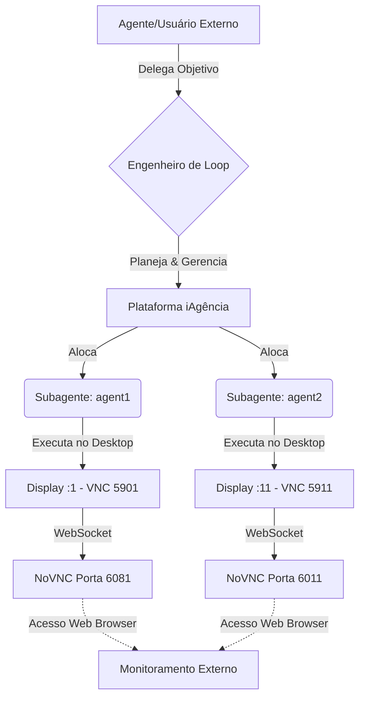
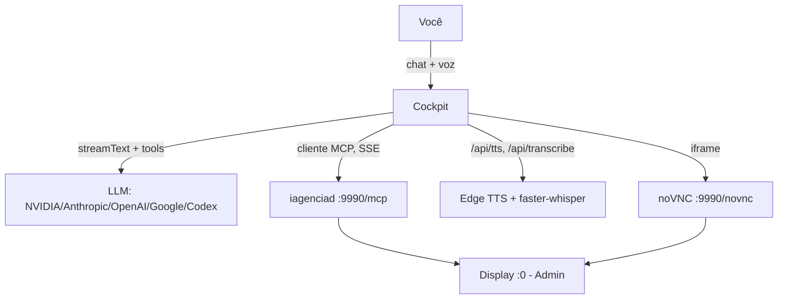

← [Índice de documentação](README.md)

# 🚀 iAgência: O Sistema Operacional para Agentes de IA

**Tags:** `#infra` `#vnc` `#docker` `#design-principles`

> **A missão:** Evoluir continuamente a plataforma iAgência para se tornar a melhor e mais autônoma infraestrutura de execução para agentes de IA do mundo.

*(Diagrama representativo da arquitetura Open Infra)*

## 👁️ A Nova Visão: Inteligência na Plataforma

A iAgência não é apenas um ambiente de execução isolado. É um **Sistema Operacional Autônomo** projetado para abstrair toda a complexidade infraestrutural.

O usuário ou agente externo **não precisa** conhecer a infraestrutura, instalar ferramentas ou gerenciar portas. O fluxo é simples:
1. **O Agente Externo** informa o *Objetivo*.
2. **O Engenheiro de Loop (Plataforma)** elabora o plano, aloca recursos e coordena a execução.
3. **Os Especialistas (Subagentes)** executam o trabalho em ambientes 100% isolados.

> [!TIP]
> **Inteligência Centralizada:** A inteligência operacional mora na plataforma, garantindo a máxima reutilização de conhecimento e evolução incremental.

---

## 🏗️ Estado Atual da Infraestrutura (O Mapeamento)

Atualmente, o nó principal (`192.168.159.128`) sustenta um ambiente de alto desempenho que virtualiza Múltiplos Desktops X11 simultâneos, garantindo isolamento total de processos e interface visual para agentes autônomos.

Após varredura da infraestrutura com o novo scanner, identificamos **3 Ambientes Virtuais (VNC) Simultâneos** em execução, orquestrados pela plataforma:

### 🖥️ Ambiente 1: Administração & Host
O ambiente mestre, utilizado para gerência global e acesso privilegiado.
- **Display:** `:0`
- **Usuário:** `roberto`
- **Porta Interna VNC:** `5900`
- **Porta Web (NoVNC):** `6080` (Acessível via Browser)

### 🤖 Ambiente 2: Agente 1 (Worker Isolado)
Ambiente completamente segregado (Sandbox) dedicado à execução de automações visuais via UI.
- **Display:** `:1`
- **Usuário:** `agent1` (Isolado)
- **Porta Interna VNC:** `5901`
- **Porta Web (NoVNC):** `6081`

### 🤖 Ambiente 3: Agente 2 (Worker Alternativo)
Segundo ambiente de execução em massa, preparado para receber delegações de tarefas paralelas (Multi-Threading Visual).
- **Display:** `:11`
- **Usuário:** `roberto` (Sessão Secundária)
- **Porta Interna VNC:** `5911`
- **Porta Web (NoVNC):** `6011`

---

## 📊 Arquitetura de Comunicação Visual

```mermaid
graph TD
    A[Agente/Usuário Externo] -->|Delega Objetivo| B{Engenheiro de Loop}
    B -->|Planeja & Gerencia| C[Plataforma iAgência]
    
    C -->|Aloca| D(Subagente: agent1)
    C -->|Aloca| E(Subagente: agent2)
    
    D -->|Executa no Desktop| F[Display :1 - VNC 5901]
    E -->|Executa no Desktop| G[Display :11 - VNC 5911]
    
    F -->|WebSocket| H[NoVNC Porta 6081]
    G -->|WebSocket| I[NoVNC Porta 6011]
    
    H -.->|Acesso Web Browser| J[Monitoramento Externo]
    I -.->|Acesso Web Browser| J
```

---

---

## 🧠 Cockpit — Cérebro + Cabine de Comando (Novo)

Com o Mapeamento da Infraestrutura Visual consolidado, adicionamos a camada que faltava: o **Cockpit** (`cockpit/`), rodando como um quarto container (`cockpit`) na mesma rede Docker dos três Ambientes VNC.

Ele conecta como **cliente MCP** ao `iagenciad` (porta `9990`), reaproveitando as 18 ferramentas `computer_*` já existentes, e expõe:

- **Chat com loop de agente multi-provedor**: NVIDIA NIM, Anthropic, OpenAI, Google ou Codex CLI, trocável em tempo real direto na interface — sem precisar reiniciar o container.
- **Login por senha** (`COCKPIT_PASSWORD`) e **histórico persistente**: cada conversa é salva em disco e sobrevive a restart; uma barra lateral lista as conversas anteriores pelo primeiro texto, com opção de minimizar.
- **Voz de entrada e saída**: respostas do agente podem ser ouvidas (Edge TTS, velocidade ajustável via `TTS_RATE`); o botão de microfone grava e transcreve localmente via `faster-whisper` — sem depender dos servidores de voz do Google, que falham em redes/VPNs que os bloqueiam.
- **Markdown renderizado** nas respostas do agente e **colar imagem** (Ctrl+V) para providers multimodais.
- **noVNC embutido ao vivo** na mesma tela do chat, mostrando cada ação do agente conforme ela acontece. Painéis com divisórias arrastáveis e barra lateral minimizável.
- **Nenhuma ferramenta invisível**: `computer_bash_execute`, `computer_read_file` e `computer_write_file` são deliberadamente ocultadas do agente. Para rodar um comando, o agente é obrigado a abrir o Terminal visível, digitar o comando com `computer_type_text` e apertar Enter com `computer_type_keys` — exatamente como uma pessoa faria, e sempre visível no VNC.

```mermaid
graph TD
    Você -->|chat + voz| Cockpit
    Cockpit -->|streamText + tools| Brain[LLM: NVIDIA/Anthropic/OpenAI/Google/Codex]
    Cockpit -->|cliente MCP, SSE| MCP[iagenciad :9990/mcp]
    Cockpit -->|/api/tts, /api/transcribe| Voz[Edge TTS + faster-whisper]
    MCP --> Ambiente1[Display :0 - Admin]
    Cockpit -->|iframe| NoVNC[noVNC :9990/novnc]
    NoVNC --> Ambiente1
```

Detalhes completos — variáveis de ambiente, o bug de imagem em mensagens `tool` que quebrava provedores compatíveis com OpenAI, e o guia de deploy em VPS — estão em [`cockpit/README.md`](cockpit/README.md).

## 🛡️ Princípios de Design Imutáveis

Para garantir que a plataforma permaneça sustentável e atinja a visão final de ser o *SO dos Agentes*, toda modificação deve passar por este crivo:

1. **Zero Configuração Manual:** Substituir qualquer intervenção humana por scripts genéricos.
2. **Eficiência de Tokens:** Reduzir o ruído e centralizar o conhecimento na infraestrutura.
3. **Isolamento Absoluto:** Agentes operam em sessões (Displays) isoladas para evitar contaminação de variáveis de ambiente.
4. **Resiliência e Auto-Cura:** Processos orfãos de VNC e WebSockify são detectados e limpos autonomamente pela plataforma antes da reinicialização de um ciclo (Killall autônomo).

> [!IMPORTANT]
> **A Regra de Ouro:** Não crie uma solução específica se uma infraestrutura genérica pode resolver. A plataforma evolui criando "Capacidades", não remendos temporários.

---

## Relacionados

- [cockpit/README.md](cockpit/README.md) — a camada de chat/voz que consome essa infra
- [control-plane/README.md](control-plane/README.md) — provisionamento multi-tenant dessa mesma infra
- ↑ [Índice de documentação](README.md)
