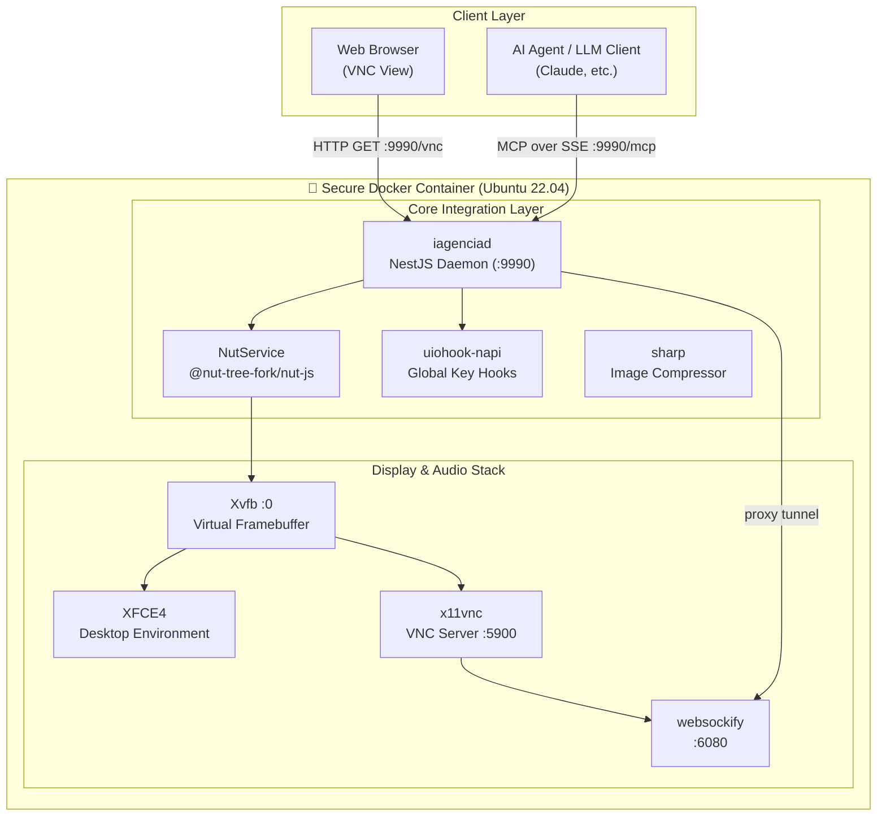

<div align="center">

# 🌌 Open Infro Agentc

### **A World-Class, Sandboxed AI Agent Desktop Automation Platform & MCP Server**

[](https://github.com/dotojr123/open-infro-agentc/actions)
[](LICENSE)
[](package.json)
[](docker-compose.yml)

<p align="center">
  <b>Empower any LLM to control, automate, and interact with a full Linux Desktop securely, seamlessly, and inside a robustly sandboxed environment.</b>
</p>

---

[🇺🇸 English](README.md) | [🇧🇷 Português (Brasil)](#-resumo-em-português)

</div>

---

## 📺 See it in Action


*(Caso o vídeo não renderize no seu leitor de markdown, o arquivo de demonstração está disponível na raiz como [demo.mp4](demo.mp4))*

---

## 💡 Why Open Infro Agentc?

### The Problem
Large Language Models (LLMs) are incredibly smart, but they are trapped. To perform real-world office tasks, they need a way to **interact with real applications** (browsers, terminals, text editors, file systems). However:
1. **Security Risks**: Running arbitrary terminal commands (`exec`) on a host machine exposes it to catastrophic vulnerabilities.
2. **Infrastructure Complexity**: Setting up virtual framebuffers (Xvfb), VNC servers, audio/video channels, and high-performance system triggers requires deep Linux expertise.
3. **Execution Latency**: Dynamic coordinate translation and heavy resource footprints lead to slow, fragile automation.

### The Solution
**Open Infro Agentc** solves all of this out-of-the-box. It provides a secure, fully sandboxed Ubuntu container complete with an XFCE4 desktop environment, pre-installed tools (Firefox, VS Code, etc.), and a highly optimized **Model Context Protocol (MCP)** server. 

Any LLM (such as Claude, GPT-4, or Gemini) can seamlessly control the desktop using natural language commands translated directly into mouse clicks, keyboard strokes, and secure file operations.

---

## ⚡ Core Pillars & Key Features

* **🛡️ Sandboxed Security (Zero-Shell execution)**: Custom refactored using shellless, direct arguments execution (`execFile`). Even if an LLM generates potentially malicious file names or path inputs, the sandbox remains completely bulletproof.
* **🌐 Native Model Context Protocol (MCP)**: Native integration via Server-Sent Events (SSE). Seamlessly exposes high-performance OS automation directly as tools for compatible AI clients (like Claude Desktop).
* **🖥️ Complete Display & Interactive Stack**: Includes **Xvfb virtual display**, **x11vnc server**, and **noVNC/websockify proxy** to stream the desktop directly to your web browser with close-to-zero latency.
* **📦 Monorepo Orchestration**: Standardized with **npm workspaces** to allow single-command dependencies resolution (`npm install`) and ultra-fast builds.
* **📊 Visual Feedback Engine**: Rapid, non-blocking frame buffer capturing via highly optimized native module builds for `uiohook-napi` and `@nut-tree-fork/nut-js`.

---

## 🏗️ Architectural Blueprint



---

## 🚀 Quick Start (1-Minute Launch)

### Prerequisites
Make sure you have [Docker](https://www.docker.com/) and [Docker Compose](https://docs.docker.com/compose/) installed on your machine.

### Launch with Docker Compose (Recommended)

1. **Clone the repository:**
   ```bash
   git clone https://github.com/dotojr123/open-infro-agentc.git
   cd open-infro-agentc
   ```

2. **Spin up the sandboxed environment:**
   ```bash
   docker compose up --build -d
   ```

3. **Access the Desktop:**
   Open your browser and navigate to:
   👉 **`http://localhost:9990/vnc`**

---

## 📡 API & MCP Tool Reference

### REST Endpoints

| Endpoint | Method | Purpose |
| :--- | :--- | :--- |
| `/vnc` | `GET` | Redirects to the integrated noVNC web view |
| `/health` | `GET` | Container health probe check |
| `/computer-use` | `POST` | Exposes low-level OS automation APIs |
| `/mcp` | `GET/POST` | Standard MCP connection endpoint (SSE) |

### Available Automations (MCP Tools)

Every action exposes a highly detailed type schema ensuring your LLM understands the coordinates, buttons, and keys:

* 🖱️ **Cursor Automation**: `computer_move_mouse`, `computer_click_mouse`, `computer_press_mouse`, `computer_drag_mouse`, `computer_cursor_position`, `computer_scroll`.
* ⌨️ **Keyboard Automation**: `computer_type_text` (typewriter effect), `computer_paste_text` (instant clipboard injection), `computer_type_keys` (shortcuts like `Ctrl+C`, `Alt+Tab`).
* 🖥️ **Application Controllers**: `computer_application` (launches/focuses VS Code, Terminal, Firefox, 1Password, etc.).
* 📁 **Secure File System Tools**: `computer_write_file`, `computer_read_file` (handles base64 encoded streams safely).

---

## 🛠️ Local Development (Outside Docker)

If you are on a compatible Linux environment and wish to develop outside of Docker, follow these steps:

1. **Install required system dev dependencies:**
   ```bash
   sudo apt-get install -y cmake build-essential git \
     libx11-dev libxtst-dev libxinerama-dev libxi-dev \
     libxt-dev libxrandr-dev libxkbcommon-dev libxkbcommon-x11-dev \
     xclip
   ```

2. **Install monorepo workspace dependencies:**
   ```bash
   npm install
   ```

3. **Build the packages:**
   ```bash
   npm run build
   ```

4. **Launch development daemon:**
   ```bash
   npm run start:dev
   ```

---

## 🇧🇷 Resumo em Português

**Open Infro Agentc** é uma plataforma de nível mundial para automação de desktop por Inteligência Artificial dentro de um ambiente Linux (`Ubuntu 22.04`) completamente isolado via Docker. 

O projeto conta com um servidor **Model Context Protocol (MCP)** nativo, permitindo que LLMs como Claude e GPT-4 controlem navegadores (Firefox), editores de código (VS Code) e executem tarefas complexas com total segurança.

### Por que se destaca?
* **Segurança Reforçada**: Desenvolvido com execução sem shell (`execFile`) para evitar riscos de injeção de comandos.
* **Monorepo Otimizado**: Utiliza npm workspaces para instalação com comando único (`npm install`).
* **Visualização Fluida**: Servidor noVNC integrado permitindo monitorar o agente em tempo real pelo navegador na porta `9990`.

---

## 📄 License & Attribution

Distributed under the **Apache-2.0 License**. See [LICENSE](LICENSE) for details.

This project is a premium, hardened fork of [Bytebot](https://github.com/bytebot-ai/bytebot) — Copyright Bytebot AI, Apache-2.0. We thank the original authors for their outstanding contribution to the open-source community.
