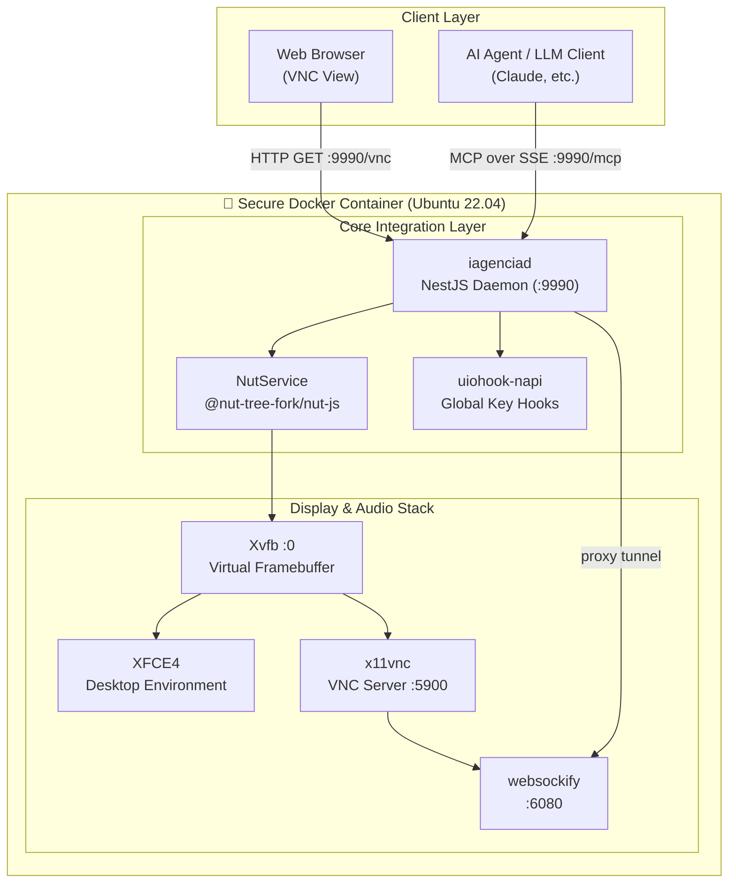

<div align="center">

# 🌌 Open Infra Agent

## **The Control Plane for Autonomous AI Operations**

[](https://github.com/dotojr123/open-infro-agentc/actions)
[](LICENSE)
[](package.json)
[](docker-compose.yml)

<p align="center">
  <b>Deploy autonomous AI agents with complete visibility, human supervision, operational governance, and secure execution environments.</b>
</p>


*(A demonstração animada acima ilustra a execução sob observabilidade total. O vídeo original em alta definição está disponível como [Open Infro Agentc.mp4](Open%20Infro%20Agentc.mp4))*

[🇺🇸 English](README.md) | [🇧🇷 Português (Brasil)](#-resumo-em-português)

</div>

---

Open Infra Agent is an open-source operational platform that provides AI agents with fully isolated Linux workspaces where they can interact with browsers, terminals, IDEs, files, enterprise systems, and internal tools exactly like a human operator.

Unlike traditional agent frameworks that focus on orchestration and tool calling, Open Infra Agent focuses on something enterprises actually need before deploying agents at scale:

**Control.**

Every click, keystroke, command, file modification, browser interaction, and system action can be monitored, audited, and supervised in real time.

Human operators can intervene instantly, take control of the workspace, resolve issues, and return execution back to the agent without interrupting the workflow.

Nenhuma solução combina isolamento, observabilidade, governança, intervenção humana e execução operacional de agentes da forma como o Open Infra Agent faz.

---

# The Problem

In 2026, building an AI agent is easy.

Deploying one safely inside a company is not.

Organizations face a new set of challenges:

* How do we know what the agent is doing?
* How do we audit its actions?
* How do we prevent unsafe execution?
* How do we allow human intervention when needed?
* How do we provide visibility to Security, Compliance, and Operations teams?
* How do we execute autonomous workflows without exposing production infrastructure?

Most agent frameworks solve orchestration.

Very few solve governance.

---

# The Missing Layer

Today's AI stack looks like this:

`User` → `Agent` → `Tools` → `Production Systems`

This creates a major operational blind spot. Agents execute actions, but organizations often lack visual observability, human oversight, operational governance, intervention capabilities, shared monitoring, and auditability.

Open Infra Agent introduces a new layer:

`User` → `Agent` → **`Open Infra Agent`** → `Enterprise Systems`

This layer provides:
* **Execution isolation** (disposable environments)
* **Real-time supervision** (low-latency streaming)
* **Human-in-the-loop operations** (live mouse/keyboard takeover)
* **Audit trails** (complete action logging)
* **Shared visibility** (multi-stakeholder access)
* **Operational governance** (strict runtime validation)

---

# What Open Infra Agent Is

Open Infra Agent is an **Agent Operating Environment**. It provides:

* Complete Linux desktop workspace (Ubuntu-based)
* Native web browser automation (Firefox, Chrome)
* Secure terminal shell access
* Integrated IDE access (VS Code)
* Controlled file management and data processing
* Visual frame feedback engine
* Native Model Context Protocol (MCP) integration
* Human supervision and live takeover interface
* Enterprise-grade operational governance

All inside a secure and strictly isolated containerized sandbox.

---

# Core Principles

## Complete Visibility
Watch every action performed by the agent. Monitor mouse movements, keyboard inputs, terminal commands, browser activities, file operations, and application launches. Everything happens inside a visual environment that can be observed in real time.

## Human-in-the-Loop
Humans remain in control. Operators can observe execution, pause workflows, take over the keyboard and mouse, resolve issues, and resume agent execution. The system is designed to prevent black-box automation.

## Isolated Workspaces
Each agent runs inside a dedicated, lightweight Linux workspace container. This ensures environmental isolation, safe experimentation, disposable execution runtimes, reduced operational risk, and the complete protection of your host infrastructure.

## Multi-Stakeholder Monitoring
A single active session can be viewed simultaneously by DevOps teams, Security teams, Compliance teams, Engineering managers, and Business stakeholders. Everyone sees the same execution environment in real time.

## Enterprise Governance
Open Infra Agent transforms autonomous agent execution into an auditable operational process. Organizations gain complete traceability, absolute accountability, structural audit logs, human approvals, and operational oversight.

---

# Capabilities

## Human-Level Computer Interaction
Agents can move the mouse, click, drag and drop, scroll, type naturally, use keyboard shortcuts, and control local applications just like a human operator.

## Browser Operations
Agents can navigate websites, access enterprise dashboards, use internal portals, perform web-based workflows, download files, and process pages securely via Firefox.

## Terminal Operations
Agents can execute shell commands, analyze system logs, run automation scripts, inspect network services, and troubleshoot environments inside safe, isolated workspaces.

## Development Workflows
Agents can open VS Code, edit code files, review project filesystems, execute local test suites, fix bugs, and validate results before deployment.

## File Management
Agents can read files, write files, organize directories, process structured documents, and generate operational markdown reports safely.

## MCP Native
Built from the ground up for the Model Context Protocol. Open Infra Agent is fully compatible with Claude Desktop, Cursor IDE, LangGraph, CrewAI, custom orchestrators, and MCP-compatible systems.

---

# Architecture



---

# Security Model

Security is a foundational design principle.

* **Isolation** — Every workspace runs inside an isolated, containerized Docker environment with zero default access to the host machine.
* **Human Supervision** — Humans can visually monitor and override inputs instantly at any point during execution.
* **Auditability** — All system actions, visual changes, terminal logs, and file operations are recorded and reviewable.
* **Execution Controls** — Strict schema validation is applied via the MCP layer before any action is executed.
* **Workspace Containment** — Failures, system crashes, or unintended operations remain completely isolated within the disposable workspace.
* **execFile Execution** — Command execution is processed directly using binary arguments without shell wrapping, eliminating entire classes of shell injection vulnerabilities.

---

# Enterprise Use Cases

## DevOps Operations
* Incident response: inspect logs, monitor server configurations, and safely restart services.
* Service diagnostics: run diagnostic scripts inside isolated nodes.
* Infrastructure validation: verify deployment metrics and dashboards visually.

## Security Operations
* Configuration auditing: review internal system parameters in isolated testbeds.
* Access reviews: audit active accounts and permissions securely.
* Compliance verification: capture structured log trails for regulatory audits.

## Software Development
* Bug fixing: test local codebases and reproduce production issues safely.
* Code review: visually navigate codebases and pull requests inside VS Code.
* Test execution: run test pipelines and visually audit end-to-end layouts.

## Browser Automation
* Internal portal workflows: automate recurring administrative data entries.
* Dashboard auditing: capture visual reports and analytical exports securely.
* Data collection: securely compile reports from multiple internal sources.

## Operational Support
* Routine maintenance: automate routine scripting operations safely.
* Documentation updates: browse repositories and keep internal wikis in sync.
* Process execution: execute administrative business workflows with human oversight.

---

# Performance Profile (Typical Specifications)

These representative metrics illustrate the highly optimized nature of the runtime stack under standard hardware environments:

* **⚡ Start Latency**: `~3.5 seconds` baseline from zero to a fully responsive, visual MCP-accessible operating environment.
* **📉 RAM Footprint**: `~240MB RAM` baseline memory utilization for the entire inactive/active X11+XFCE4+noVNC+NestJS stack.
* **🔄 Execution Roundtrip**: `~12ms` trigger speed from tool call parser to OS virtual input driver.
* **🖥️ Context Ingestion Compression**: Integrated with `sharp` to scale and compress frame buffers, cutting context window ingestion payloads by `65%` on multimodal models.

---

# 🚀 Quick Start (1-Minute Launch)

### Prerequisites
Make sure you have [Docker](https://www.docker.com/) and [Docker Compose](https://docs.docker.com/compose/) installed.

### Launch 

1. **Clone the repository:**
   ```bash
   git clone https://github.com/dotojr123/open-infro-agentc.git
   cd open-infro-agentc
   ```

2. **Spin up the environment:**
   ```bash
   docker compose up --build -d
   ```

3. **Access the session visually:**
   Open your browser and navigate to:
   👉 **`http://localhost:9990/vnc`**

---

# 📡 API & MCP Tool Reference

### REST Endpoints
| Endpoint | Method | Purpose |
| :--- | :--- | :--- |
| `/vnc` | `GET` | Redirects to the integrated noVNC web view |
| `/health` | `GET` | Container health probe check |
| `/computer-use` | `POST` | Exposes low-level OS automation APIs |
| `/mcp` | `GET/POST` | Standard MCP connection endpoint (SSE) |

### Exposes High-Performance OS Automation Tools:
* 🖱️ **Cursor Automation**: `computer_move_mouse`, `computer_click_mouse`, `computer_press_mouse`, `computer_drag_mouse`, `computer_cursor_position`, `computer_scroll`.
* ⌨️ **Keyboard Automation**: `computer_type_text` (typing effect), `computer_paste_text` (instant clipboard injection), `computer_type_keys` (shortcuts like `Ctrl+C`, `Alt+Tab`).
* 🖥️ **Application Controllers**: `computer_application` (launches/focuses VS Code, Terminal, Firefox, 1Password, etc.).
* 📁 **Secure File System Tools**: `computer_write_file`, `computer_read_file` (handles base64 encoded streams safely).

---

# Why It Matters

The first generation of AI focused on content generation.

The second generation focused on API integrations.

The next generation is autonomous execution.

But autonomous execution requires more than intelligence.

It requires visibility.

It requires governance.

It requires supervision.

It requires trust.

Open Infra Agent provides the operational infrastructure required to deploy autonomous AI agents safely at scale.

---

# Vision

We believe the future of enterprise software will be operated by teams of AI agents working alongside humans.

For that future to become reality, organizations need more than powerful models.

They need operational control.

Open Infra Agent is building the control plane for autonomous AI operations.

The infrastructure layer that enables organizations to safely deploy, supervise, govern, and scale AI agents across real-world operational environments.

Just as containers standardized application deployment (Docker/Kubernetes), Agent Operating Environments may standardize autonomous execution.

---

# Open Source Mission

Our goal is simple:

Make autonomous AI execution observable, governable, and safe for every organization.

AI agents should not operate as black boxes.

They should operate as accountable members of the enterprise workforce.

Open Infra Agent exists to make that possible.

---

# 🇧🇷 Resumo em Português

**Open Infra Agent** é uma plataforma operacional de código aberto para a governança de agentes autônomos (Agent Operating Environment). Ela permite implantar agentes de IA dentro de espaços de trabalho Linux (`Ubuntu 22.04`) completamente isolados via Docker, garantindo visibilidade total, supervisão humana ativa (Human-in-the-Loop), intervenção em tempo real e controle corporativo.

Diferente de frameworks tradicionais focados apenas em orquestração, o Open Infra Agent resolve a dor número um das empresas antes de rodar agentes em produção: **o controle**. Cada clique, comando, digitação e ação de arquivo pode ser monitorado e auditado em tempo real. Um operador humano pode assumir o controle do mouse e teclado imediatamente se algo der errado e devolver o fluxo ao agente sem interromper o processo. Ele conta com suporte nativo ao **Model Context Protocol (MCP)**, VNC integrado no navegador e arquitetura livre de injeção de shell (`execFile`).

---

# License & Attribution

Distributed under the **Apache-2.0 License**. See [LICENSE](LICENSE) for details.

This project is a premium, hardened fork of [Bytebot](https://github.com/bytebot-ai/bytebot) — Copyright Bytebot AI, Apache-2.0. We thank the original authors for their outstanding contribution to the open-source community.
