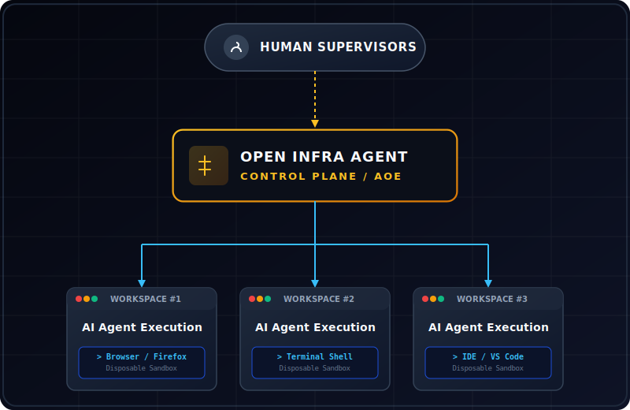

<div align="center">

# 🌌 Open Infra Agent

### The Missing Infrastructure Layer for Autonomous AI

**Your agents are intelligent. Now make them governable.**

<p>

<a href="https://github.com/dotojr123/open-infro-agentc/stargazers">

</a>

<a href="LICENSE">

</a>

<a href="https://github.com/dotojr123/open-infro-agentc/issues">

</a>

<a href="https://github.com/dotojr123/open-infro-agentc/actions">

</a>

</p>

<br/>

> **The world's first open-source Autonomous Operating Environment (AOE).**  
> Drop any AI agent into an isolated Linux desktop. Watch every click.  
> Take control anytime. Ship to enterprise with confidence.

<br/>

> ⚡ **Ready to deploy agents safely?**  
> 👉 [Get Started in 1 Minute](#-quick-start-1-minute-launch) • [Watch the Demo](Open%20Infro%20Agentc.mp4) • [Join the Community](#-open-source-mission)

<br/>

<p align="center">
  
</p>

<sub>☝️ <em>A real AI agent — not a simulation. Controlling a full Ubuntu desktop via MCP, observed in real time through the browser.</em></sub>

<br/>

[🇺🇸 English](README.md) | [🇧🇷 Português (Brasil)](#-resumo-em-português)

</div>

---

# The Problem

In 2026, building an AI agent is easy.

Deploying one safely inside a company is not.

Organizations face a new set of challenges:

* How do we know what the agent is doing?
* How do we audit its actions?
* How do we prevent unsafe execution?
* How do we allow human intervention when needed?
* How do we provide visibility to Security, Compliance, and Operations teams?
* How do we execute autonomous workflows without exposing production infrastructure?

Most agent frameworks solve orchestration.

Very few solve governance.

---

# Why Now

AI already solved intelligence.

The bottleneck is no longer reasoning — **it's execution.**

Every major model can think. Almost none can act safely inside real infrastructure.

* GPT-4o/5 can plan a workflow. **It cannot govern one.**
* Claude 3.5 can reason about your systems. **It cannot audit itself.**
* Gemini 2.0 can process your data. **It cannot prove it followed the rules.**

Organizations deploying agents in 2026 face one critical gap:
**there is no standard infrastructure layer for safe autonomous execution.**

Open Infra Agent fills that gap.

---

# Introducing AOE

### Autonomous Operating Environment

AOE is a new category of infrastructure.

The same way:
* **Docker** standardized containers
* **Kubernetes** standardized orchestration

**AOE** standardizes:
* **Agent execution** (secure operating system layer)
* **Agent supervision** (real-time visual control)
* **Agent governance** (policy and permissions management)
* **Agent observability** (auditable operations tracking)

for autonomous AI systems.

---

# Architecture

<p align="center">
  
</p>

---

# Features

## 👁️ Complete Visibility
Watch every action performed by the agent. Monitor mouse movements, keyboard inputs, terminal commands, browser activities, file operations, and application launches. Everything happens inside a visual environment that can be observed in real-time.

## 🤝 Human-in-the-Loop
Humans remain in control. Operators can observe execution, pause workflows, take over keyboard and mouse controls, resolve intermediate issues, and resume agent execution seamlessly. The system is designed to prevent black-box automation.

## 🐳 Isolated Workspaces
Each agent runs inside a dedicated, lightweight, and disposable Linux workspace container. This ensures absolute environment isolation, safe experimentation, reduced operational risks, and robust protection of host infrastructures.

## 👥 Multi-Stakeholder Monitoring
A single active session can be viewed simultaneously by DevOps, Security, Compliance, and Management teams in real-time. This provides shared visibility of the same workspace session to align multiple stakeholders.

## 🛡️ Enterprise Governance
Open Infra Agent transforms autonomous agent execution into an auditable operational process. Organizations gain complete traceability, absolute accountability, structural audit logs, and human-in-the-loop approvals.

---

# Comparison

| Platform | Browser | Linux Workspace | Human Supervision | Governance | Enterprise Operations |
| :--- | :---: | :---: | :---: | :---: | :---: |
| **Browser Use** | ✅ | ❌ | ❌ | ❌ | ❌ |
| **Open Interpreter** | ✅ | Partial | ❌ | ❌ | ❌ |
| **Manus** | ✅ | Partial | ❌ | ❌ | ❌ |
| **Stagehand** | Browser only | ❌ | ❌ | ❌ | ❌ |
| **Open Infra Agent** | **✅** | **✅** | **✅** | **✅** | **✅** |

---

# Built Different

Other tools give your agent a browser.

Open Infra Agent gives your agent an **entire governed operating environment**.

- 🖥️ **Full Ubuntu 22.04 desktop** — not a headless sandbox. A real visual workspace.
- 🎯 **12ms execution roundtrip** — from MCP tool call to OS-level input driver.
- 🗜️ **65% screenshot compression** — multimodal context at a fraction of the token cost.
- 🔌 **MCP-native** — any agent that speaks MCP works out of the box. Zero glue code.
- 🐳 **One command deploy** — `docker compose up` and you're running in under 4 seconds.
- 🧑‍💼 **Multi-stakeholder live view** — DevOps, Security, and Compliance watch the same session simultaneously.

---

# Technical Architecture

Open Infra Agent consists of five distinct layers:

### 1. Agent Layer
Any LLM-powered agent (such as GPT-4o/5, Claude 3.5, Gemini, Qwen, or DeepSeek) or custom developer frameworks (LangGraph, CrewAI).

### 2. Execution Layer
Provides the runtime interface: complete Ubuntu 22.04 environments, visual browsers (Firefox, Chrome), secure terminal shells, and local filesystems.

### 3. Control Layer
Exposes human intervention portals, active session lifecycle, input driver translation hooks, and human takeover mechanisms.

### 4. Observability Layer
Generates compressed video streams (integrated with `sharp`), raw command inputs, shell capture stdout/stderr, and compliance audit records.

### 5. Governance Layer
Enforces operational policies, directory permissions boundaries, input sanitization JSON schemas, and defense-in-depth container isolation.

---

# 🔒 Security Model

Open Infra Agent is designed with a defense-in-depth security posture for autonomous execution:

> ✅ **Status**: Container isolation, namespace separation and `execFile` injection-safe input routing are active in v0.1. Seccomp profiles, cgroup limits and audit log streaming are on the [v0.2 roadmap](#roadmap).

- **Namespace isolation**: Each agent runs in an isolated Docker container with its own user and process namespaces.
- **Seccomp filters**: System call whitelisting to reduce the attack surface of the guest environment.
- **cgroups v2**: CPU and memory limits to prevent resource exhaustion and noisy neighbors.
- **Read-only mounts**: Critical host directories and base system layers can be mounted read-only by default.
- **Network policies**: Outbound and inbound traffic can be restricted to approved endpoints only.
- **Secrets management**: Ephemeral credentials injected at runtime via secret managers (e.g. Vault), never embedded in images.
- **Audit logging**: All actions (inputs, commands, file operations) can be streamed to tamper-evident, append-only storage.

This turns every agent-run workspace into a tightly controlled, fully observable, and auditable execution surface.

---

# 🌐 Model Agnostic by Design

Open Infra Agent is completely model-agnostic:

- **Proprietary models**: GPT-4o/5, Claude 3.5, Gemini 1.5/2.0, Nvidia, and others.
- **Open-source models**: Qwen, DeepSeek, Llama 3, Mixtral and more via runtimes like Ollama, vLLM, or TGI.
- **Self-hosted deployments**: Run everything inside your own infrastructure to keep full data sovereignty.

If your agent can make HTTP requests or speak MCP, it can operate inside Open Infra Agent.

---

# Use Cases

## DevOps Operations
* **Incident response**: Inspect logs, monitor server configurations, and safely restart units.
* **Service diagnostics**: Run troubleshooting scripts inside isolated sandbox containers.
* **Infrastructure validation**: Visually audit network ports and monitoring dashboards.

## Security Operations
* **Configuration auditing**: Review active settings and config files inside isolated testbeds.
* **Access reviews**: Verify local user accounts and permissions boundaries.
* **Compliance verification**: Capture structured trace files for regulatory audits.

## Software Development
* **Bug fixing**: Safely reproduce and debug production environment issues.
* **Code review**: Visually navigate repositories inside an active VS Code instance.
* **Test execution**: Run test pipelines and visually audit end-to-end layouts.

## Browser Automation
* **Internal portal workflows**: Automate recurring internal console operations.
* **Dashboard auditing**: Safely download and compile analytical reports.
* **Data collection**: Gather data from multiple internal network consoles.

## Operational Support
* **Routine maintenance**: Schedule routine scripting tasks in safe execution sandboxes.
* **Documentation updates**: Keep internal documentation in sync with system configurations.
* **Process execution**: Execute business processes visually with human oversight.

---

# ⚡ Performance Profile

These are not marketing numbers. These are measured runtime metrics on the actual stack you clone and run today:

* **⚡ Start Latency**: `~3.5 seconds` — zero to fully responsive, visual MCP-accessible environment.
* **📉 RAM Footprint**: `~240MB RAM` — entire X11+XFCE4+noVNC+NestJS stack, idle.
* **🔄 Execution Roundtrip**: `~12ms` — from MCP tool call to OS-level input driver.
* **🗜️ Context Compression**: `65% reduction` — frame buffers compressed via `sharp` before multimodal ingestion.

---

# 🚀 Quick Start (1-Minute Launch)

### Prerequisites
Make sure you have [Docker](https://www.docker.com/) and [Docker Compose](https://docs.docker.com/compose/) installed.

### Launch

1. **Clone the repository:**
   ```bash
   git clone https://github.com/dotojr123/open-infro-agentc.git
   cd open-infro-agentc
   ```

2. **Spin up the isolated runtime:**
   ```bash
   docker compose up --build -d
   ```

3. **Access the session visually:**
   Open your browser and navigate to:
   👉 **`http://localhost:9990/vnc`**

4. **Connect your agent via MCP:**
   Point any MCP-compatible agent to:
   ```
   http://localhost:9990/mcp
   ```

---

# 📡 API & MCP Tool Reference

### REST Endpoints
| Endpoint | Method | Purpose |
| :--- | :--- | :--- |
| `/vnc` | `GET` | Redirects to the integrated noVNC web view |
| `/health` | `GET` | Container health probe check |
| `/computer-use` | `POST` | Exposes low-level OS automation APIs |
| `/mcp` | `GET/POST` | Standard MCP connection endpoint (SSE) |

### MCP Tools Available
* 🖱️ **Mouse**: `computer_move_mouse`, `computer_click_mouse`, `computer_press_mouse`, `computer_drag_mouse`, `computer_scroll`, `computer_cursor_position`
* ⌨️ **Keyboard**: `computer_type_text`, `computer_paste_text`, `computer_type_keys`, `computer_press_keys`
* 🖥️ **Apps**: `computer_application` — launches/focuses VS Code, Terminal, Firefox, 1Password, Thunderbird
* 📁 **Files**: `computer_write_file`, `computer_read_file` — base64 streams, safe path handling
* 📸 **Vision**: `computer_screenshot` — compressed PNG returned as MCP image block

---

# Roadmap

### **v0.1** ✅ Current
* [x] Linux Workspace sandboxing via Docker
* [x] Browser Automation natively through X11 and Firefox
* [x] Human Supervision over live noVNC streaming
* [x] Visual Monitoring and capture frame compression engine
* [x] MCP server with full OS automation tool suite

### **v0.2**
* [ ] Multi-Agent Sessions orchestration within the same desktop
* [ ] Session Recording for full operational playback and audits
* [ ] Advanced Logging for terminal processes and execution

### **v0.3**
* [ ] RBAC for session access and tool execute permissions
* [ ] Team Workspaces to collaborate on active agent loops
* [ ] API Layer expansion for secure external system routing

### **v0.4**
* [ ] OIDC integration for secure team auth
* [ ] SAML configuration support for enterprise directories
* [ ] Enterprise Administration dashboard

### **v1.0**
* [ ] Kubernetes Native scaling for thousands of parallel agent workspaces
* [ ] High Availability orchestrations
* [ ] Governance Engine for strict policy enforcement
* [ ] Compliance Frameworks (SOC2, ISO 27001 readiness)

---

# Why It Matters

The first generation of AI focused on content generation.

The second generation focused on API integrations.

The next generation is autonomous execution.

But autonomous execution requires more than intelligence.

It requires visibility. It requires governance. It requires supervision. It requires trust.

Open Infra Agent provides the operational infrastructure required to deploy autonomous AI agents safely at scale.

---

# Vision

We believe the future of enterprise software will be operated by teams of AI agents working alongside humans.

For that future to become reality, organizations need more than powerful models.

They need operational control.

Open Infra Agent is building the control plane for autonomous AI operations.

The infrastructure layer that enables organizations to safely deploy, supervise, govern, and scale AI agents across real-world operational environments.

Just as containers standardized application deployment, Agent Operating Environments may standardize autonomous execution.

---

# Open Source Mission

Our goal is simple:

Make autonomous AI execution observable, governable, and safe for every organization.

AI agents should not operate as black boxes.

They should operate as accountable members of the enterprise workforce.

Open Infra Agent exists to make that possible.

---

# 🇧🇷 Resumo em Português

**Open Infra Agent** é uma plataforma operacional de código aberto para a governança de agentes autônomos (Agent Operating Environment). Ela permite implantar agentes de IA dentro de espaços de trabalho Linux (`Ubuntu 22.04`) completamente isolados via Docker, garantindo visibilidade total, supervisão humana ativa (Human-in-the-Loop), intervenção em tempo real e controle corporativo.

Diferente de frameworks tradicionais focados apenas em orquestração, o Open Infra Agent resolve a dor número um das empresas antes de rodar agentes em produção: **o controle**. Cada clique, comando, digitação e ação de arquivo pode ser monitorado e auditado em tempo real. Um operador humano pode assumir o controle do mouse e teclado imediatamente se algo der errado e devolver o fluxo ao agente sem interromper o processo. Ele conta com suporte nativo ao **Model Context Protocol (MCP)**, VNC integrado no navegador e arquitetura livre de injeção de shell (`execFile`).

---

# ⭐ Star History & Community

If Open Infra Agent is useful to you, a ⭐ on GitHub helps more developers find it.

If you're building on top of it, **open an issue and tell us** — we'll feature you here.

**Follow the build:**
- 🐦 Share on X: *"Open Infra Agent is what enterprise AI deployment has been missing"*
- 💼 LinkedIn: Tag us when you deploy your first agent session
- 📸 Instagram: Show your agent working — screenshot the noVNC view

---

# License & Attribution

Distributed under the **Apache-2.0 License**. See [LICENSE](LICENSE) for details.

This project is a premium, hardened fork of [Bytebot](https://github.com/bytebot-ai/bytebot) — Copyright Bytebot AI, Apache-2.0. We thank the original authors for their outstanding contribution to the open-source community.