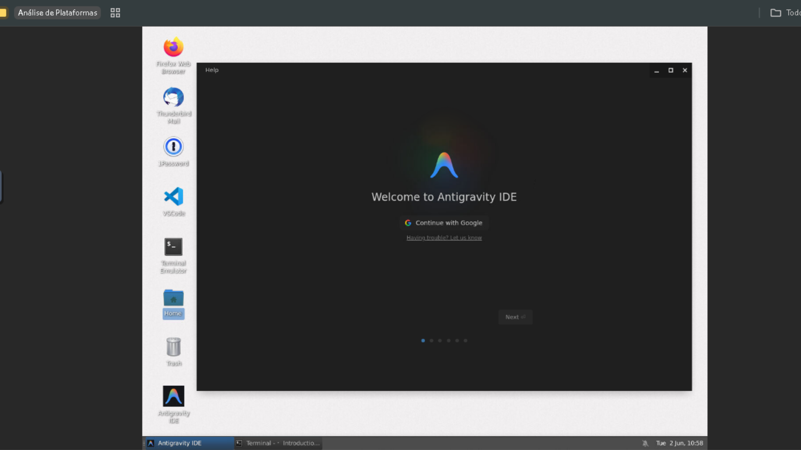

<div align="center">

# 🌌 Open Infra Agent

### Give AI a Body. Run the Mind.

**O Organismo Digital para Agentes Autônomos.**

<p>

<a href="https://github.com/dotojr123/open-infro-agentc/stargazers">

</a>

<a href="LICENSE">

</a>

<a href="https://github.com/dotojr123/open-infro-agentc/issues">

</a>

<a href="https://github.com/dotojr123/open-infro-agentc/actions">

</a>

</p>

<br/>

> **The world's first open-source Autonomous Operating Environment (AOE).**  
> Drop any AI agent into an isolated Linux desktop. Watch every click.  
> Take control anytime. Ship to enterprise with confidence.

<br/>

> ⚡ **Ready to deploy agents safely?**  
> 👉 [Get Started in 1 Minute](#-quick-start-1-minute-launch) • [Watch the Demo](Open%20Infro%20Agentc.mp4) • [Join the Community](#-open-source-mission)

<br/>

<p align="center">
  
</p>

<sub>☝️ <em>A real AI agent — not a simulation. Controlling a full Ubuntu desktop via MCP, observed in real time through the browser.</em></sub>

<br/>

[🇺🇸 English](README.md) | [🇧🇷 Português (Brasil)](#-resumo-em-português)

</div>

---

# 🧬 Manifesto Open Infra Agent: Do Cérebro ao Organismo Digital

## 1. O Paradigma da Inteligência Desencarnada

Atualmente, a Inteligência Artificial vive o paradoxo do **"cérebro em um tanque"**. Possuímos modelos de linguagem (LLMs) como ChatGPT, Claude e DeepSeek que operam como mentes extraordinariamente potentes, porém isoladas em um vácuo funcional. Elas residem em um hiato operacional: são capazes de processar informações, mas incapazes de interagir de forma autônoma e física com o ecossistema digital. A inteligência, por si só, não age; ela apenas contempla.

Como **Arquitetos de Sistemas Bio-digitais**, compreendemos que para transcender a infraestrutura de TI tradicional, precisamos projetar uma biologia digital. Não se trata de mais uma camada de software, mas de um ambiente vivo onde a inteligência pode, finalmente, habitar. Nosso chamado é fundamental: **Dê um corpo para a IA (Give AI a Body).**

---

## 2. A Anatomia do Organismo Digital

O **Open Infra Agent** não é um framework; é um sistema metabólico que converte a inteligência bruta dos LLMs em ação no mundo real. Ele fornece as células, as conexões e os órgãos necessários para que uma "mente" digital se torne um ser operacional.

| Componente Técnico | Função Biológica | Descrição Arquitetônica |
| :--- | :---: | :--- |
| **LLM (Claude, Gemini, etc.)** | **Cérebro** | A inteligência central e o processamento de decisões. |
| **Open Infra Agent** | **Corpo** | O organismo completo que integra todas as partes em um todo funcional. |
| **MCP (Model Context Protocol)** | **Sistema Nervoso** | O protocolo que transporta sinais e reflexos entre o cérebro e as ferramentas. |
| **Browser (BrowserOS)** | **Olhos** | Percepção visual e navegação: a capacidade de enxergar a teia digital. |
| **Shell / APIs** | **Mãos** | A capacidade de agir no mundo, manipular arquivos e transformar o ambiente. |
| **Containers (Docker/Namespaces)** | **Corpo Físico / Pele** | O invólucro que garante isolamento, proteção e limites de segurança. |
| **Memória (ChromaDB)** | **Experiências** | O histórico persistente que transforma processamento efêmero em aprendizado. |
| **Logs e Auditoria** | **Consciência** | A auto-observação contínua que permite a supervisão e a governança. |

---

## 3. O Mundo Invisível por Trás do Agente

Enquanto o usuário final interage apenas com a interface do agente, o Open Infra Agent constrói o ecossistema invisível — o **"World Behind the Agent"** — indispensável para a vida autônoma. Este mundo sustenta a existência da IA através de três dimensões vitais:

*   **Ambiente de Execução (Habitat)**: Onde a IA vive e respira. Através de containers isolados, criamos um habitat seguro onde o agente pode operar livremente sem comprometer o sistema hospedeiro.
*   **Percepção e Ação (Sentidos e Membros)**: Através do Browser e do Shell, o agente deixa de apenas "falar" sobre tarefas para "tocar" e "alterar" a realidade digital. É a transição do discurso para a execução.
*   **Continuidade (Evolução)**: Sem memória, não há biologia. Ao integrar experiências passadas, o organismo evolui, garantindo que cada interação informe as decisões futuras.

---

## 4. Diferenciação Estratégica: O "Cockpit" vs. O "Motor"

No mercado atual, a maioria dos projetos foca na venda de infraestrutura bruta — peças soltas de um quebra-cabeça técnico. O Open Infra Agent redefine essa hierarquia ao posicionar-se como o ecossistema que unifica inteligência e operação.

Nós estabelecemos uma cadeia de existência clara: 
$$\text{Usuário} \longrightarrow \text{Odysseus (O Cockpit/Interface)} \longrightarrow \text{Hermes (O Motor de Execução)} \longrightarrow \text{Open Infra Agent (O Organismo Digital)}$$

Enquanto outros oferecem ferramentas, nós oferecemos a vida. Não competimos com os "cérebros" (LLMs); nós somos o corpo que os torna úteis. Não vendemos infraestrutura; vendemos o organismo para a inteligência existir.

---

## 5. Pilares da Autonomia Governável

Seus agentes são inteligentes; agora, torne-os governáveis. Um organismo autônomo sem governança é um risco biológico. O Open Infra Agent garante que a autonomia seja exercida com total confiança e segurança através de três pilares:

1.  **Isolação Total (Pele Protetora)**: O uso de containers garante que todas as ações do agente ocorram em um ambiente confinado, protegendo a integridade do ecossistema externo.
2.  **Observabilidade Total (Consciência Operacional)**: Cada pulso, cada comando e cada percepção é logado. Isso não é apenas auditoria; é a consciência do sistema, permitindo total transparência.
3.  **Supervisão Humana (O Elo Vital)**: *"Watch every action. Take control anytime."* O sistema é desenhado para o *Human-in-the-loop*, garantindo que o controle humano possa ser reassumido ao menor sinal de anomalia.

---

# 🏛️ Arquitetura Técnica

<p align="center">
  
</p>

O Open Infra Agent consiste em cinco camadas de infraestrutura metabólica:

1.  **Agent Layer (Cérebro)**: Qualquer LLM (como GPT-4o/5, Claude 3.5, Gemini, Qwen ou DeepSeek) ou frameworks de desenvolvimento (LangGraph, CrewAI).
2.  **Execution Layer (Membros/Habitat)**: O ambiente virtual completo (Ubuntu 22.04), navegadores visuais (Firefox), terminal e sistema de arquivos.
3.  **Control Layer (Reflexos)**: Canais de intervenção humana direta, ciclo de vida das sessões ativas e drivers de inputs de mouse e teclado.
4.  **Observability Layer (Consciência)**: Gravação e compressão de imagens via `sharp`, captura de stdout/stderr de comandos de terminal e logs detalhados de auditoria.
5.  **Governance Layer (Sistema Imunológico)**: Políticas de execução, restrição de portas de rede, permissões de diretórios e sandboxing via Docker.

---

# 📸 Demonstração Visual

### 🖥️ Monitoramento de Sessão em Tempo Real
Assista a todas as ações, comandos de terminal e cliques no navegador de forma síncrona. O streaming de tela é servido nativamente via web, permitindo a intervenção humana imediata e controle compartilhado.

<p align="center">
  
</p>

<sub>☝️ <em>Uma sessão ativa de um agente rodando <strong>Claude</strong> em uma sandbox Linux, totalmente monitorada e interativa pelo navegador.</em></sub>

<br/>

### 🛠️ Ambiente de Trabalho Integrado
O Open Infra Agent encapsula um desktop completo com terminal, VS Code, Firefox e ferramentas de sistema, ideal para auditorias, DevOps e workflows complexos.

<p align="center">
  
</p>

<sub>☝️ <em>Desktop virtual interno exibindo o <strong>Antigravity IDE</strong> e VS Code prontos para execução autônoma segura.</em></sub>

---

# 📊 Comparativo de Plataformas

| Plataforma | Navegador Integrado | Desktop Linux Virtual | Supervisão Humana | Governança Corporativa | Operações Seguras |
| :--- | :---: | :---: | :---: | :---: | :---: |
| **Browser Use** | ✅ | ❌ | ❌ | ❌ | ❌ |
| **Open Interpreter** | ✅ | Parcial | ❌ | ❌ | ❌ |
| **Manus** | ✅ | Parcial | ❌ | ❌ | ❌ |
| **Stagehand** | Apenas Browser | ❌ | ❌ | ❌ | ❌ |
| **Open Infra Agent** | **✅** | **✅** | **✅** | **✅** | **✅** |

---

# ⚡ Performance e Especificações

*   **⚡ Latência de Inicialização**: `~3.5 segundos` — do comando à disponibilidade visual total do agente.
*   **📉 Uso de Memória**: `~240MB RAM` — pilha completa X11 + XFCE4 + noVNC + NestJS ociosa.
*   **🔄 Latência de Comando**: `~12ms` — do envio da ferramenta MCP à execução de driver no OS.
*   **🗜️ Compressão Multimodal**: `65% de redução` — buffer de tela otimizado pelo [compressor](file:///c:/Users/Doto/Desktop/PROJETOS-2026/open-infro-agentc/iagenciad/src/mcp/compressor.ts) antes da ingestão pelo LLM.

---

# 🚀 Quick Start (1-Minute Launch)

### Pré-requisitos
Certifique-se de possuir o [Docker](https://www.docker.com/) e o [Docker Compose](https://docs.docker.com/compose/) instalados no seu ambiente.

### Execução

1.  **Clone o repositório:**
    ```bash
    git clone https://github.com/dotojr123/open-infro-agentc.git
    cd open-infro-agentc
    ```

2.  **Suba o organismo virtual:**
    ```bash
    docker compose up --build -d
    ```

3.  **Acesse o desktop virtual visualmente:**
    Abra seu navegador e entre em:
    👉 **`http://localhost:9990/vnc`**

4.  **Conecte seu agente via MCP:**
    Configure seu agente MCP para apontar para a URL:
    ```
    http://localhost:9990/mcp
    ```

---

# 📡 Referência de APIs & Ferramentas MCP

### Endpoints REST do Daemon

| Endpoint | Método | Objetivo |
| :--- | :--- | :--- |
| `/vnc` | `GET` | Redireciona para o noVNC web view integrado. |
| `/health` | `GET` | Probe de verificação de integridade do NestJS. |
| `/computer-use` | `POST` | API REST interna para comandos de baixo nível no OS. |
| `/mcp` | `GET/POST` | Endpoint de conexão do servidor MCP (via Server-Sent Events). |

### Ferramentas MCP Disponíveis

*   🖱️ **Mouse**: `computer_move_mouse`, `computer_click_mouse`, `computer_press_mouse`, `computer_drag_mouse`, `computer_scroll`, `computer_cursor_position`
*   ⌨️ **Keyboard**: `computer_type_text`, `computer_paste_text`, `computer_type_keys`, `computer_press_keys`
*   🖥️ **Apps**: `computer_application` — gerencia ciclo de vida e foca janelas (Firefox, VS Code, Terminal, etc.)
*   📁 **Files**: `computer_write_file`, `computer_read_file` — leitura e escrita de arquivos encapsulada
*    vision **Vision**: `computer_screenshot` — captura de tela comprimida retornada como bloco de imagem nativa no MCP

---

# 🗺️ Roadmap de Evolução

### **v0.1** ✅ Atual
*   [x] Sandboxing de Workspace Linux via Docker.
*   [x] Automação nativa do navegador via Firefox e X11.
*   [x] Supervisão humana direta através do noVNC no browser.
*   [x] Motor de compressão inteligente de frames para o LLM.
*   [x] Servidor MCP nativo de computer-use.

### **v0.2**
*   [ ] Orquestração de sessões multi-agente no mesmo desktop virtual.
*   [ ] Gravação completa de sessões para auditorias e playback.
*   [ ] Rastreamento de processos e logs detalhados do shell do terminal.

### **v0.3**
*   [ ] Controle de Acesso Baseado em Regras (RBAC) para permissões de ferramentas.
*   [ ] Workspaces compartilhados em equipe no mesmo agente loop.
*   [ ] Expansão da API gateway para comunicação externa segura.

---

# 🇧🇷 Resumo em Português

O **Open Infra Agent** é um ambiente operacional autônomo (AOE) de código aberto focado em fornecer um **"corpo digital"** para inteligências artificiais. Ao invés de apenas orquestrar chamadas de APIs textuais, ele executa os agentes de IA dentro de habitats Linux completamente isolados e visuais (`Ubuntu 22.04` via Docker). 

A plataforma oferece visibilidade total em tempo real das ações do agente, suporte nativo ao **Model Context Protocol (MCP)**, VNC acoplado ao navegador com suporte a takeover humano de mouse/teclado instantâneo, e controle imunológico contra vulnerabilidades de injeção de shell (`execFile` seguro).

---

# ⭐ Licença e Comunidade

Distribuído sob a licença **Apache-2.0 License**. Veja [LICENSE](LICENSE) para detalhes.

Este projeto é um fork premium do [Bytebot](https://github.com/bytebot-ai/bytebot) — Copyright Bytebot AI, Apache-2.0. Agradecemos imensamente aos autores originais pela contribuição brilhante ao ecossistema de código aberto.