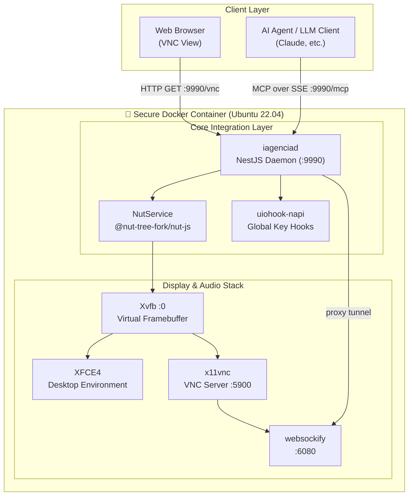

<div align="center">

# 🌌 Open Infra Agent

**AI-powered infrastructure operations platform that can monitor, diagnose, automate and manage cloud, servers and DevOps workflows autonomously.**

[](https://github.com/dotojr123/open-infro-agentc/actions)
[](LICENSE)
[](package.json)
[](docker-compose.yml)

[🇺🇸 English](README.md) | [🇧🇷 Português (Brasil)](#-resumo-em-português)

</div>

---

## The Problem

Modern infrastructure is fragmented and overwhelmingly complex. 

Teams manage servers in one place, logs in another, cloud resources elsewhere, alerts in another dashboard, and automation scripts in dozens of repositories. When an incident occurs, engineers are forced to context-switch across multiple tools.

The result:
❌ Alert fatigue
❌ Slow incident response
❌ Manual troubleshooting
❌ Operational bottlenecks
❌ Expensive DevOps overhead

---

## The Solution

**Open Infra Agent** acts as your AI Infrastructure Operator.

Instead of manually navigating dashboards, running shell commands, searching documentation, and investigating incidents, you simply describe the objective in plain English. 

The agent executes the workflow. Built inside a **fully sandboxed Ubuntu container** with an XFCE4 desktop and native **Model Context Protocol (MCP)**, it securely translates your natural language commands directly into mouse clicks, keyboard strokes, and secure file operations.

---

## 📺 See it in Action


*(A demonstração animada está disponível na raiz como [demo.gif](demo.gif). Caso prefira, o vídeo original em alta qualidade está disponível como [Open Infro Agentc.mp4](Open%20Infro%20Agentc.mp4))*

---

## Capabilities

### 🛡️ Sandboxed Security (Zero-Shell Execution)
The agent operates within a custom-built, bulletproof environment using shellless, direct arguments execution (`execFile`). Even if an LLM generates potentially malicious commands, the host machine remains completely safe.

### 🌐 Native Model Context Protocol (MCP)
Native integration via Server-Sent Events (SSE). Seamlessly exposes high-performance OS automation directly as tools for compatible AI clients (like Claude Desktop).

### 🖥️ Complete Display & Interactive Stack
Includes **Xvfb virtual display**, **x11vnc server**, and **noVNC/websockify proxy** to stream the desktop directly to your web browser with close-to-zero latency.

### 🤖 Automation Toolkit
* **Cursor & Keyboard Automation**: Human-like typing, clicking, dragging, and shortcut execution.
* **Application Controllers**: Automates VS Code, Terminal, Firefox, and more.
* **Secure File System Tools**: Safe, controlled file reading and writing.

---

## 🏗️ Architecture



---

## Real World Use Cases

### 🔍 Incident Response
**"Why is production down?"**
The agent investigates logs, metrics, services, and deployments, navigating through terminal windows and monitoring dashboards to provide a comprehensive root cause analysis.

### ☁️ Cloud & Server Management
**"Set up a new Nginx reverse proxy for the web app."**
The agent opens the terminal, installs the necessary packages, configures the domain, and restarts the service—all within the secure sandbox.

### 🔐 Security Auditing
**"Analyze the server for exposed ports and misconfigurations."**
The agent runs security scans, reviews firewall rules, and compiles a detailed report of vulnerabilities.

---

## 🚀 Quick Start (1-Minute Launch)

### Prerequisites
* [Docker](https://www.docker.com/)
* [Docker Compose](https://docs.docker.com/compose/)

### Launch 

1. **Clone the repository:**
   ```bash
   git clone https://github.com/dotojr123/open-infro-agentc.git
   cd open-infro-agentc
   ```

2. **Spin up the environment:**
   ```bash
   docker compose up --build -d
   ```

3. **Access the Desktop:**
   Open your browser and navigate to:
   👉 **`http://localhost:9990/vnc`**

---

## 🗺️ Roadmap

### Phase 1 (Current)
- Core Agent Integration
- Sandboxed Desktop Environment
- Native MCP Server over SSE
- noVNC Browser Streaming

### Phase 2
- Multi-Agent Collaboration (Planner, Executor, Audit)
- Advanced Context Memory
- RAG integration for proprietary infrastructure docs

### Phase 3
- Autonomous Cloud Operations via Cloud CLI tools integration
- Headless CI/CD Pipeline Automation

---

## 🌟 Vision

We believe infrastructure management should become **conversational**.

In the same way GitHub transformed collaboration and Docker transformed deployment, **Open Infra Agent aims to transform infrastructure operations through AI.** We are building a future where you don't need to memorize a thousand CLI flags or navigate a labyrinth of dashboards. You just need to know what you want to achieve.

---

## 🤝 Contributing

We welcome contributions from everyone! Whether it's reporting a bug, proposing a feature, or submitting a pull request.
Please read our [Contributing Guidelines](CONTRIBUTING.md) and [Code of Conduct](CODE_OF_CONDUCT.md).

---

## 🛡️ Security

For vulnerability reporting and security policies, please see [SECURITY.md](SECURITY.md).

---

## 🇧🇷 Resumo em Português

**Open Infra Agent** é uma plataforma inovadora para automação de infraestrutura e desktop por Inteligência Artificial. Dentro de um ambiente Linux (`Ubuntu 22.04`) completamente isolado via Docker, ele atua como seu Operador de Infraestrutura autônomo.

O projeto conta com um servidor **Model Context Protocol (MCP)** nativo, permitindo que LLMs como Claude e GPT-4 controlem terminais, navegadores, e sistemas de arquivos com total segurança, traduzindo linguagem natural em ações reais. 

---

## 📄 License

Distributed under the **Apache-2.0 License**. See [LICENSE](LICENSE) for details.

This project is a premium, hardened fork of [Bytebot](https://github.com/bytebot-ai/bytebot) — Copyright Bytebot AI, Apache-2.0. We thank the original authors for their outstanding contribution to the open-source community.
