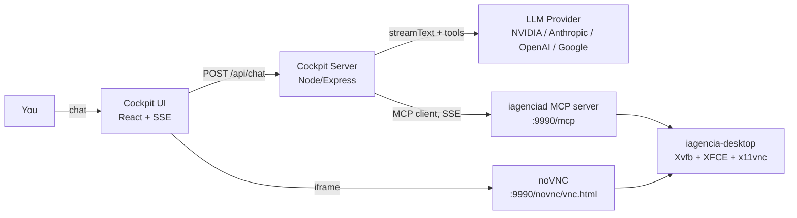

# Cockpit — The Brain + Cockpit Layer for Open Infra Agent

> **The missing "eyes and a steering wheel" for your agent.** Cockpit pairs any tool-calling LLM with the Open Infra Agent's computer-use MCP server and a live noVNC feed, so you watch every click, keystroke, and command happen on a real desktop in real time — the same experience as Gemini Spark or Manus.io, but pointed at a full Linux desktop instead of a sandboxed headless browser.

 

---

## What this is

Open Infra Agent already ships the **body**: a containerized Ubuntu desktop (`iagencia-desktop`) with mouse/keyboard/screenshot/application control exposed as 18 MCP tools, plus a noVNC feed to watch it live. What it didn't have was a **brain** (an LLM driving those tools) or a **cockpit** (a chat surface to talk to that brain while watching the desktop). This directory is that missing layer.



Everything the agent does — opening an app, typing a command into a **visible terminal window**, clicking a button — happens through real X11 input events on the same display the noVNC iframe is showing you. There is no hidden execution channel: if the agent can't show you what it's doing on screen, it doesn't do it that way (see [Design decision: no invisible tools](#design-decision-no-invisible-tools)).

## Features

- **Multi-provider brain**, switchable without redeploying: NVIDIA NIM (OpenAI-compatible), Anthropic, OpenAI, or Google — pick a default via `.env`, or override provider **and** model per message straight from the chat header dropdown/input.
- **Live tool trace** in the chat: every `tool-call` / `tool-result` is rendered as a collapsible "Examinando..." block, including inline screenshot thumbnails when a tool returns an image.
- **Zero tool duplication**: tools aren't hand-defined in Cockpit — they're discovered at runtime from the existing `iagenciad` MCP server via the Vercel AI SDK's MCP client.
- **Streaming end-to-end**: token-by-token text and tool events flow to the browser over Server-Sent Events as they happen.
- **Provider-safe multi-step tool loop**: a hand-rolled round-by-round loop (see below) instead of the SDK's fully automatic one, specifically to survive OpenAI-compatible providers' constraints around image content.

## Prerequisites

- The `iagencia-desktop` stack already running and reachable on the `open-infra-agent-v2_default` Docker network (this is the default when you `docker compose up` the root project).
- Docker + Docker Compose on the host.
- An API key for at least one supported LLM provider.

## Quick start

```bash
cd cockpit
cp .env.example .env
# edit .env: set LLM_PROVIDER, LLM_MODEL and the matching API key

docker compose up -d --build
```

Open `http://<host>:8080`. Chat on the left, live desktop on the right.

> If your `docker compose` is the legacy standalone `docker-compose` (v1.29.x) and a rebuild after a config change throws `ERROR: ... 'ContainerConfig'`, that's a known bug in that version — run `docker rm -f cockpit` once, then `docker-compose up -d` again (no `--force-recreate`).

## Environment variables

| Variable | Default | Purpose |
|---|---|---|
| `PORT` | `8080` | Port the Cockpit server listens on |
| `LLM_PROVIDER` | `nvidia` | `nvidia` \| `anthropic` \| `openai` \| `google` — default brain, overridable per request from the UI |
| `LLM_MODEL` | `z-ai/glm-5.2` | Default model id for the selected provider |
| `NVIDIA_BASE_URL` | `https://integrate.api.nvidia.com/v1` | NVIDIA NIM's OpenAI-compatible endpoint |
| `NVIDIA_API_KEY` | — | Required if `LLM_PROVIDER=nvidia` |
| `ANTHROPIC_API_KEY` | — | Required if `LLM_PROVIDER=anthropic` |
| `OPENAI_API_KEY` | — | Required if `LLM_PROVIDER=openai` |
| `GOOGLE_API_KEY` | — | Required if `LLM_PROVIDER=google` |
| `MCP_URL` | `http://iagencia-desktop:9990/mcp` | Where the computer-use MCP server lives. Docker DNS name by default — change if Cockpit runs outside the compose network |

**Switching models at runtime:** you don't need to touch `.env` or restart anything to try a different model — the provider dropdown and model-id input at the top of the chat panel are sent with every request and override the `.env` default for that message onward.

## Design decisions

### No invisible tools

The underlying MCP server exposes `computer_bash`, `computer_read_file`, and `computer_write_file` — direct, headless execution with no on-screen trace. Cockpit's MCP client (`src/agent/mcpClient.ts`) filters these three out before handing the tool set to the LLM. This is deliberate, not an oversight: the entire value proposition is *supervised, observable* automation. If the agent needs to run a shell command, the system prompt requires it to open the visible Terminal application (`computer_application`), type the command with real keystrokes (`computer_type_text`), and press Enter (`computer_type_keys`) — exactly as a human operator would, and exactly as visible in the noVNC feed.

### Manual multi-step loop, not automatic `maxSteps`

The AI SDK's built-in automatic tool loop feeds each tool's raw result — including a screenshot's base64 image — straight into the next model call as part of a `tool`-role message. **OpenAI-compatible chat-completions APIs reject image content inside `tool` messages with a bare `400 Bad Request`** (Anthropic's native API is the exception; its `tool_result` blocks do support images). Since Cockpit is provider-agnostic by design, it can't rely on that exception.

`src/agent/loop.ts` implements its own round-by-round loop (`maxSteps: 1` per call, looped manually) and, between rounds, strips any image out of tool-result messages — replacing it with a short text summary — then re-inserts the image as a **separate follow-up `user` message**, which every provider accepts. A ~600ms delay between rounds also smooths out rate-limit bursts on free-tier endpoints.

### No history persistence, no auth (yet)

Chat history lives in memory, keyed by a client-generated session id, for the lifetime of the container. There's no login. Both are intentional MVP scope cuts — see [Roadmap](#roadmap).

## Deploying to a fresh VPS

1. Copy this whole repository to the VPS (this archive already excludes `node_modules`, build output, `.git`, and any `.env` with real secrets).
2. Bring up the body first: `docker compose up -d --build` from the repo root (builds and starts `iagencia-desktop`).
3. Then the brain: `cd cockpit && cp .env.example .env` (fill in your API key) `&& docker compose up -d --build`.
4. Open firewall ports `8080` (Cockpit) and `9990` (noVNC, embedded via iframe — must be reachable from the same browser that loads Cockpit). Keep `6080/6081/6091` closed unless you specifically want the raw noVNC UI too; Cockpit only needs `9990`.
5. Point a browser at `http://<vps-ip>:8080`.

For anything beyond a quick trial, put both ports behind a reverse proxy with TLS (Caddy is already vendored in the parent project for the other stacks) rather than exposing them raw over HTTP — the noVNC session and the chat currently have no authentication layer.

## Roadmap (explicitly out of scope for this MVP)

- Persistent chat history (database-backed)
- Authentication / multi-user support
- Human-in-the-loop confirmation before sensitive tool calls
- TLS/reverse-proxy termination baked into this compose file
- Vision-capable model recommendation baked into the UI (today you must pick a vision model yourself if you want the agent to actually *see* screenshots — several models on NVIDIA NIM are text-only and will fall back to inspecting the terminal instead)

## License

Apache-2.0, matching the parent [Open Infra Agent](../README.md) project.
