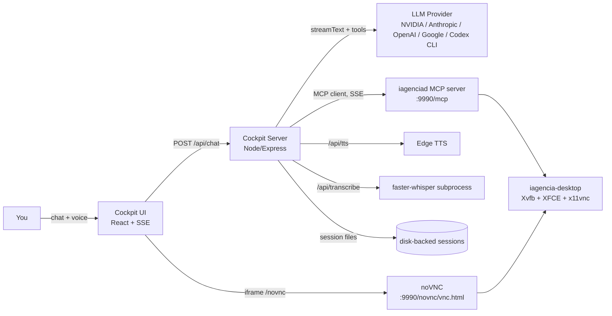

# Cockpit — The Brain + Cockpit Layer for Open Infra Agent

> **The missing "eyes and a steering wheel" for your agent.** Cockpit pairs any tool-calling LLM with the Open Infra Agent's computer-use MCP server and a live noVNC feed, so you watch every click, keystroke, and command happen on a real desktop in real time — the same experience as Gemini Spark or Manus.io, but pointed at a full Linux desktop instead of a sandboxed headless browser.

 

---

## What this is

Open Infra Agent already ships the **body**: a containerized Ubuntu desktop (`iagencia-desktop`) with mouse/keyboard/screenshot/application control exposed as MCP tools, plus a noVNC feed to watch it live. Cockpit is the **brain** (an LLM driving those tools) and the **cockpit** itself (an authenticated chat surface, with voice in and out, that talks to that brain while you watch the desktop).



Everything the agent does — opening an app, typing a command into a **visible terminal window**, clicking a button — happens through real X11 input events on the same display the noVNC iframe is showing you. There is no hidden execution channel: if the agent can't show you what it's doing on screen, it doesn't do it that way (see [Design decision: no invisible tools](#design-decision-no-invisible-tools)).

## Features

- **Multi-provider brain**, switchable without redeploying: NVIDIA NIM (OpenAI-compatible), Anthropic, OpenAI, Google, or **Codex CLI** (runs `codex exec` as a subprocess, authenticated via a ChatGPT account instead of a generic API key) — pick a default via `.env`, or override provider **and** model per message from the settings popover (⚙ icon in the header).
- **Password-gated access**: a single shared `COCKPIT_PASSWORD` guards `/api/*`; the browser holds a bearer token in `localStorage` after login.
- **Persistent, multi-conversation history**: every session is written to disk (`/app/data`, mount a volume there) and survives restarts. A sidebar lists past conversations by their first message, click to switch; "Nova conversa" starts a fresh one.
- **Voice in and out**:
  - *Output*: every assistant reply has a ▶ button that synthesizes speech via Edge TTS (`TTS_VOICE`, default `pt-BR-AntonioNeural`), sped up via `TTS_RATE` (default `+20%` — the raw Edge TTS pace reads as sluggish for a chat UI).
  - *Input*: the 🎤 button records with `MediaRecorder` and posts the blob to `/api/transcribe`, which runs it through **faster-whisper** (CTranslate2) as a short-lived Python subprocess — loads the model, transcribes, exits, so it never holds a resident model in memory between recordings. This intentionally does **not** use the browser's built-in `webkitSpeechRecognition`: that API phones home to Google's speech servers and fails outright on networks/VPNs that block them, which local `faster-whisper` sidesteps entirely.
- **Markdown rendering** for assistant messages (`marked` + `DOMPurify`) — lists, bold, code blocks render properly instead of showing raw markdown syntax.
- **Image paste** (Ctrl+V) for multimodal messages — thumbnail preview above the input, sent as a multimodal `CoreMessage`. Only works with nvidia/anthropic/openai/google; pasting while the `codex` provider is selected shows an inline warning instead of silently failing (the Codex CLI integration is text-only, see below).
- **Resizable, collapsible layout**: drag the dividers between the conversation sidebar, chat panel, and desktop panel; collapse the sidebar to a thin strip. Widths persist in `localStorage`.
- **Live tool trace** in the chat: every `tool-call` / `tool-result` is rendered as a collapsible "Ações executadas" block, including inline screenshot thumbnails when a tool returns an image.
- **Zero tool duplication**: tools aren't hand-defined in Cockpit — they're discovered at runtime from the existing `iagenciad` MCP server via the Vercel AI SDK's MCP client.
- **Streaming end-to-end**: token-by-token text and tool events flow to the browser over Server-Sent Events as they happen.
- **Provider-safe multi-step tool loop**: a hand-rolled round-by-round loop instead of the SDK's fully automatic one, specifically to survive OpenAI-compatible providers' constraints around image content.

## Prerequisites

- The `iagencia-desktop` stack already running and reachable on the same Docker network.
- Docker + Docker Compose on the host.
- An API key for at least one supported LLM provider (or a Codex CLI login for the `codex` provider — see `iagenciad`'s docs for the device-auth flow).

## Quick start

```bash
cd cockpit
cp .env.example .env
# edit .env: set COCKPIT_PASSWORD, LLM_PROVIDER, LLM_MODEL and the matching API key

docker compose up -d --build
```

Open `http://<host>:8080`, log in with `COCKPIT_PASSWORD`. Sidebar of conversations on the left, chat in the middle, live desktop on the right.

## Environment variables

| Variable | Default | Purpose |
|---|---|---|
| `PORT` | `8080` | Port the Cockpit server listens on |
| `COCKPIT_PASSWORD` | `changeme` | Shared password gating the whole app — **change this before exposing Cockpit past a private LAN** |
| `LLM_PROVIDER` | `codex` | `nvidia` \| `anthropic` \| `openai` \| `google` \| `codex` — default brain, overridable per message from the settings popover |
| `LLM_MODEL` | `z-ai/glm-5.2` | Default model id for the selected provider |
| `NVIDIA_BASE_URL` | `https://integrate.api.nvidia.com/v1` | NVIDIA NIM's OpenAI-compatible endpoint |
| `NVIDIA_API_KEY` | — | Required if `LLM_PROVIDER=nvidia` |
| `ANTHROPIC_API_KEY` | — | Required if `LLM_PROVIDER=anthropic` |
| `OPENAI_API_KEY` | — | Required if `LLM_PROVIDER=openai` |
| `GOOGLE_API_KEY` | — | Required if `LLM_PROVIDER=google` |
| `TTS_PROVIDER` | `edge` | Only `edge` (Microsoft Edge TTS) is implemented today |
| `TTS_VOICE` | `pt-BR-AntonioNeural` | Any [Edge TTS voice](https://github.com/rany2/edge-tts) short-name |
| `TTS_RATE` | `+20%` | SSML `rate` — relative percentage, passed straight to Edge TTS |
| `WHISPER_MODEL` | `base` | faster-whisper model size (`tiny`/`base`/`small`/...) — bigger is slower and more accurate |
| `MCP_URL` | `http://iagencia-desktop:9990/mcp` | Where the computer-use MCP server lives. Docker DNS name by default — change if Cockpit runs outside the compose network |

**Switching models at runtime:** you don't need to touch `.env` or restart anything to try a different model — the settings popover (⚙ in the header) is sent with every request and overrides the `.env` default for that message onward.

## Design decisions

### No invisible tools

The underlying MCP server exposes `computer_bash_execute`, `computer_read_file`, and `computer_write_file` — direct, headless execution with no on-screen trace. Cockpit's MCP client (`backend/src/agent/mcpClient.ts`) filters these out before handing the tool set to the LLM. This is deliberate, not an oversight: the entire value proposition is *supervised, observable* automation. If the agent needs to run a shell command, the system prompt requires it to open the visible Terminal application (`computer_application`), type the command with real keystrokes (`computer_type_text`), and press Enter (`computer_type_keys`) — exactly as a human operator would, and exactly as visible in the noVNC feed.

### Manual multi-step loop, not automatic `maxSteps`

The AI SDK's built-in automatic tool loop feeds each tool's raw result — including a screenshot's base64 image — straight into the next model call as part of a `tool`-role message. **OpenAI-compatible chat-completions APIs reject image content inside `tool` messages with a bare `400 Bad Request`** (Anthropic's native API is the exception; its `tool_result` blocks do support images). Since Cockpit is provider-agnostic by design, it can't rely on that exception.

`backend/src/agent/loop.ts` implements its own round-by-round loop (`maxSteps: 1` per call, looped manually) and, between rounds, strips any image out of tool-result messages — replacing it with a short text summary — then re-inserts the image as a **separate follow-up `user` message**, which every provider accepts. A ~600ms delay between rounds also smooths out rate-limit bursts on free-tier endpoints.

### Local STT as a subprocess, not a resident model

The first local-STT implementation used `@xenova/transformers` (onnxruntime) with the model loaded once and kept warm in the Node process — it held ~800MB resident permanently, which OOM-killed the container on a memory-constrained shared host. Voice input now shells out to a small Python script (`backend/scripts/transcribe.py`) using **faster-whisper** (CTranslate2) per request: it loads, transcribes, and exits, so the memory cost is a brief spike instead of a permanent tax. This requires `python3` + `faster-whisper` in the runtime image and a Debian-based Node image (`node:20-slim`, not `alpine`) — CTranslate2's native extensions don't have musl/Alpine builds.

### Codex provider is text-only

`LLM_PROVIDER=codex` doesn't go through the Vercel AI SDK at all — it spawns `codex exec --json` as a subprocess and translates its event stream into the same internal format as the other providers (see `runCodexLoop` in `loop.ts`). Because it's a CLI invocation, only the latest text message is passed in; pasted images are silently unusable there, which is why the UI blocks that combination explicitly instead of failing at the API layer.

## Deploying behind a reverse proxy (recommended for anything beyond LAN use)

Voice input (`getUserMedia`) requires a secure context — Chrome/Edge simply refuse microphone access over plain HTTP on anything but `localhost`. A real deployment needs TLS, which also gives you a stable domain instead of publishing raw ports.

The pattern used for the reference production deploy (`cockpit.iagencia.app`, fronted by [Caddy](https://caddyserver.com/)):

```caddyfile
cockpit.iagencia.app {
	handle /novnc/* {
		reverse_proxy iagencia-desktop:9990
	}
	handle /websockify* {
		reverse_proxy iagencia-desktop:9990
	}
	handle {
		reverse_proxy cockpit:8080
	}
}
```

- Both `cockpit` and `iagencia-desktop` join Caddy's network so it can reach them by service name; neither container needs to publish ports to the host.
- The frontend's noVNC iframe uses a **same-origin relative URL** (`/novnc/vnc.html?...`) rather than a hardcoded `host:9990`, so it rides along on the same domain/TLS cert as the chat — see `DesktopPanel` in `frontend/src/App.tsx`.
- Caddy issues and renews the Let's Encrypt cert automatically once DNS points at the host.
- On a resource-constrained shared host, set `mem_limit`/`cpus` on both services in `docker-compose.yml` — `iagencia-desktop` (full XFCE desktop + browser) is the heavy one; `cockpit` is light except for the brief spike during voice transcription.

## Roadmap (explicitly out of scope today)

- Human-in-the-loop confirmation before sensitive tool calls
- Automatic TLS/reverse-proxy setup baked into this compose file (today it's documented, not automated)
- Vision-capable model recommendation baked into the UI (today you must pick a vision model yourself if you want the agent to actually *see* screenshots — several models on NVIDIA NIM are text-only and will fall back to inspecting the terminal instead)
- Image paste support for the `codex` provider

## License

Apache-2.0, matching the parent [Open Infra Agent](../README.md) project.
